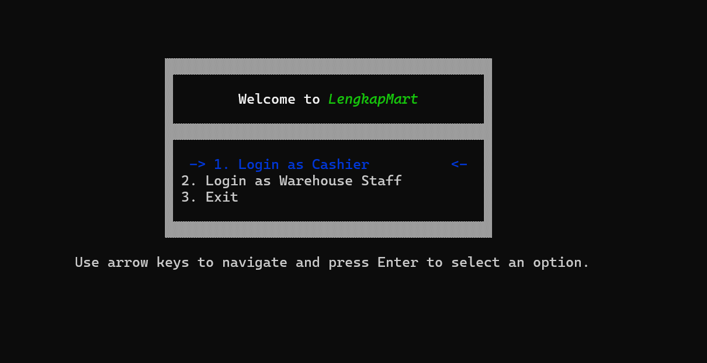
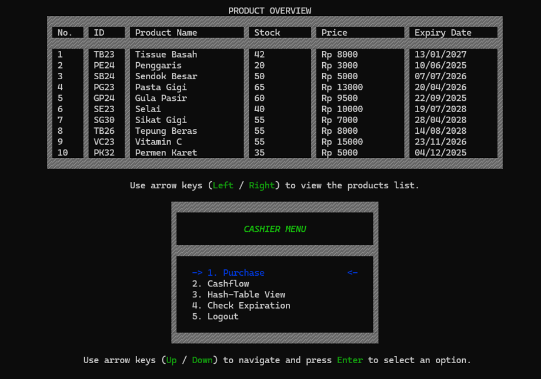
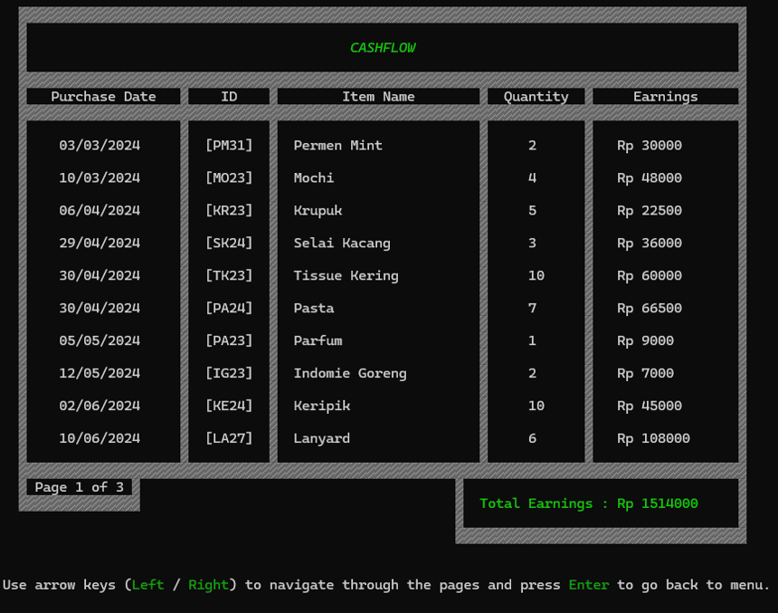

# 📦 Cashier & Warehouse Management System  
**Final Project – Data Structures (Semester 2)**  

This project is a **Cashier and Warehouse Management application** built in **C language** implementing **Hashing (division method + chaining)**.  
The main goal of the application is to manage sales transactions, product inventory, and product data validation efficiently.  

---

## 👨‍💻 Team Members
- **Kevin Joseph Handoyo (2702355302)**  
- **Muhammad Ibraahiim Putra Wahana (2702350106)**  

---

## 📂 Project Structure
- `main.c` → Main source code  
- `database.txt` → Product database  
- `cashflow.txt` → Transaction records  
  
# 🖼️ Project Preview  

Here are some previews of the program in action:  

---

## 🔹 Preview 1
  

---

## 🔹 Preview 2
  

---

## 🔹 Preview 3
  

---

## ⚙️ Features
### Cashier
- 🛒 **Purchase Product** → Process product purchase  
- 💰 **Cashflow** → View transaction history and revenue  
- 🗂 **Hash-Table View** → Display hash table structure  
- ⏳ **Check Expiration** → Validate product expiration date  

### Warehouse Management
- ➕ **Add Item** → Insert new product  
- 📦 **Add Stock** → Increase product stock  
- ❌ **Delete Stock** → Remove or decrease product stock  
- 🗂 **Hash-Table View** → Display product data in hash table  
- ⏳ **Check Expiration** → Check expired products  
- ✏️ **Update Data** → Update price & expiration date  

---

